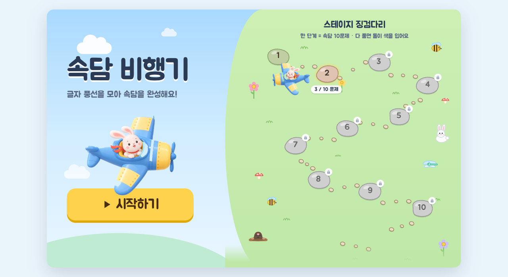
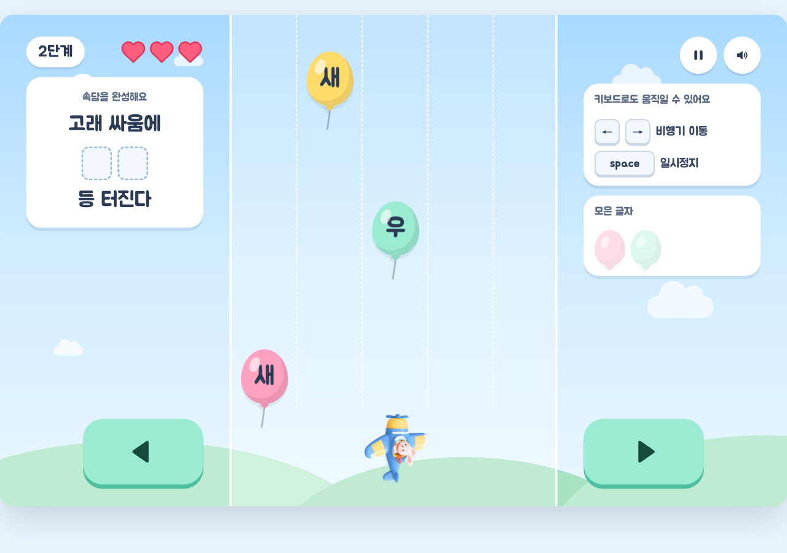

# 속담 비행기 ✈️

한국 속담의 빈칸을 하늘에서 떨어지는 글자 풍선으로 채우는 아동용 학습 게임임.
타겟은 한글을 읽을 수 있는 6~9세(유치원 후반~초등 저학년)이며, 모바일 세로 화면과
PC 와이드 화면을 모두 지원함.



## 게임 방법



- 상단에 속담 문제가 표시됨 — 예: "소 잃고 ◻◻◻ 고친다" (빈칸은 2~3글자 단어)
- 글자 풍선과 폭탄이 5개 레인을 따라 떨어짐
- 비행기를 좌우로 움직여 **정답 글자 풍선**을 받으면 빈칸이 채워짐
  - 받는 순서는 상관없음. 받은 글자는 단어 안 **원래 위치의 칸**에 채워짐
    (예: "외양간"에서 "양"을 먼저 받으면 "◻양◻")
  - 틀린 글자를 받아도 패널티 없음 (비행기 흔들림 연출만)
- **폭탄**을 받으면 하트가 1개 줄어듦 (총 3개)
- 하트를 모두 잃으면 **채운 빈칸은 그대로 유지**한 채 하트만 회복해 재도전함
- 빈칸을 모두 채우면 클리어 — 폭죽 연출과 함께 속담 전문·뜻풀이 카드가 표시됨


## 조작

| 입력 | 동작 |
| --- | --- |
| ◀ ▶ 버튼 (터치) | 비행기 한 레인씩 이동 |
| 키보드 ← → | 비행기 한 레인씩 이동 |
| 키보드 Space | 일시정지 / 재개 |
| ⏸ 버튼 | 일시정지 (이어하기 / 처음으로) |
| 🔊 버튼 | 효과음 켜기/끄기 |

## 진행 구조 — 스테이지 징검다리

- 속담 **100개** 내장, 쉬운 속담부터 순서대로 출제됨
- **돌(단계) 1개 = 속담 10문제**. 징검다리에 돌 10개가 놓여 있고, 한 돌의 10문제를
  모두 풀면 돌이 색을 입으며 다음 돌이 열림
- 난이도는 10문제 구간마다 상승함 (낙하 속도·폭탄 빈도 증가, 상한 도달 후 유지).
  31번 문제부터는 모양이 비슷한 혼동 글자(예: 간/칸)가 오답으로 섞임
- 진행도는 `localStorage` 에 **문제 단위**로 저장됨 — 재방문 시 도전 중인 돌에서
  이어하기, 완료한 돌은 처음부터 재플레이 가능 (재플레이 진행은 저장하지 않음)

## 공정성 규칙

- 판정은 낙하물이 비행기 높이(판정선)에 도달한 시점의 레인 일치 여부로 결정됨
- 놓친 정답 글자는 반드시 다시 등장함 (클리어 불가능 상태 방지)
- 폭탄은 동시에 최대 1개, 비행기 바로 위 레인에는 떨어지지 않음
- 낙하 속도는 "끝 레인 → 반대쪽 끝 레인 이동 시간 × 여유 계수"를 넘지 않게 상한이 걸려 있음

## 화면 지원

- **모바일 세로** (기본): 390×844 좌표계, 좁은 화면에서는 통째로 축소되어 맞춰짐
- **PC 와이드** (1024px 이상): 1440×900 레이아웃 — 중앙 보드 + 좌우 HUD(키보드 안내,
  모은 글자) 구성으로 자동 전환됨. 게임 도중 창 크기가 바뀌어도 이어서 진행됨

## 실행·배포

- 로컬 실행: `index.html` 을 브라우저에서 열면 됨 (서버 불필요)
- 배포: 저장소를 GitHub Pages 등에 올려 링크로 공유함.
  외부 의존성은 Google Fonts(Jua·Gowun Dodum) 1종뿐이며 오프라인에서는 시스템 폰트로 폴백함
- 효과음은 Web Audio API 로 코드 생성됨 (음원 파일 없음)

## 개발

루트 `index.html` 은 **빌드 산출물**임 — 직접 편집하지 않고 `src/` 를 수정 후 재빌드함.

```bash
python3 scripts/build.py           # src/ → index.html 생성
python3 scripts/build.py --check   # 드리프트 검사 (불일치 시 비영 종료)
node --test tests/*.test.mjs       # 단위 테스트 46건 (디렉터리 인자는 실패 — 글롭 필수)
uvx ruff check scripts/            # 빌드 스크립트 lint
```

### 폴더 구조

```
sokdam-game/
├─ index.html              # 빌드 산출물 (단일 파일, CSS·JS 인라인 — 직접 편집 금지)
├─ assets/                 # 토끼 비행기 PNG 2종 (bunny_happy / bunny_sad)
├─ src/                    # 진본 소스
│  ├─ body.html            #   화면 마크업 (디자인 시안 유래, data-action/data-role 훅)
│  ├─ style.css            #   시안 CSS + 앱 셸(화면 전환·스케일) + 연출 keyframes
│  ├─ proverbs.js          #   속담 100개 DB { problem, answer, blankStart, meaning }
│  ├─ geometry.js          #   룰 좌표계(모바일 1벌) + 뷰별 렌더 좌표 매핑
│  ├─ spawn.js             #   난이도 밴드·스폰 결정 (폭탄 제약·기아 방지)
│  ├─ game_state.js        #   인게임 룰 (낙하·판정·채움·하트) — 순수 전이 함수
│  ├─ progression.js       #   돌(단계)↔문제 매핑·이어하기 정책 — 순수
│  ├─ audio.js             #   Web Audio 효과음 7종
│  ├─ storage.js           #   localStorage 진행도 저장
│  ├─ render.js            #   모바일/웹 2뷰 렌더·징검다리 돌 생성·연출
│  └─ main.js              #   화면 전환·입력·게임 루프 배선
├─ scripts/build.py        # 단일 index.html 병합 빌드
├─ tests/                  # node --test 단위 테스트 (룰·스폰·속담 데이터·진행·좌표)
├─ docs/images/            # README 스크린샷
└─ design/sokdam-plane-design/   # 디자인 시안 원본 (참조 전용)
```

### 설계 메모

- 게임 룰은 모바일 390×844 좌표계 1벌 위에서만 동작하고, PC 뷰는 렌더 단계에서
  좌표를 환산함 — 낙하 속도 상한·스폰 공정성 검산이 좌표계와 무관하게 성립함
- 룰(`game_state`·`spawn`)은 DOM 을 모르는 순수 함수이며 `{ state, events }` 를
  반환함. 소리·애니메이션은 events 를 소비하는 `main.js` 가 담당함
- 속담 데이터 선별 기준(빈칸 2~3글자, 빈칸 내 중복 글자 없음, 정답 단어 중복 없음)은
  `tests/proverbs.test.mjs` 가 강제함
